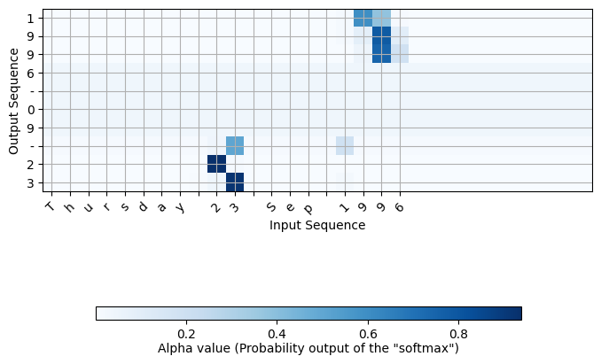

In this [experiment](G_Converting_Dates_to_Standard_Format_via_LSTM_with_Attention_Layer.ipynb), I implemented a sequence-to-sequence model with two LSTM layers and an attention layer to perform "date translation" task - converting dates in any format into a standard YYYY-MM-DD format, based on the starting code, instructions, training sample and utility functions from the [Deep Learning - Sequence Models](https://www.coursera.org/learn/nlp-sequence-models) course (by DeepLearning.AI on Coursera).

Here are some examples of expected conversion:
```
source: 3 May 1979
output: 1979-05-03 

source: 5 April 09
output: 2009-04-05 

source: 21th of August 2016
output: 2016-08-21 

source: Tue 10 Jul 2007
output: 2007-07-10 

source: Saturday May 9 2018
output: 2018-05-09 

source: March 3 2001
output: 2001-03-03 

source: March 3rd 2001
output: 2001-03-03 

source: 1 March 2001
output: 2001-03-01 
```

The attention mechanism tells the model which character in the input string to pay more attention as it generates the output string (standardized date format). 

That's just like when you're translating from English to another language, sometimes you have to stop and look back to see which parts you should pay more attention to so that you can have more accurate translation. 

The attention model is illustrated in this diagram (from the Coursera assignment): 


Please refer to the course lectures and assignments on Coursera for the mathematical details of the attention layer, as shown in the diagram below:


You can also visualize the attention weights that the model, upon trying to generate each character in the output, was paying to each character in the input string.

Note that when generating the "year" part of the output, the model was paying attention to the year in the input. Similarly for the "month" and "date" parts.

